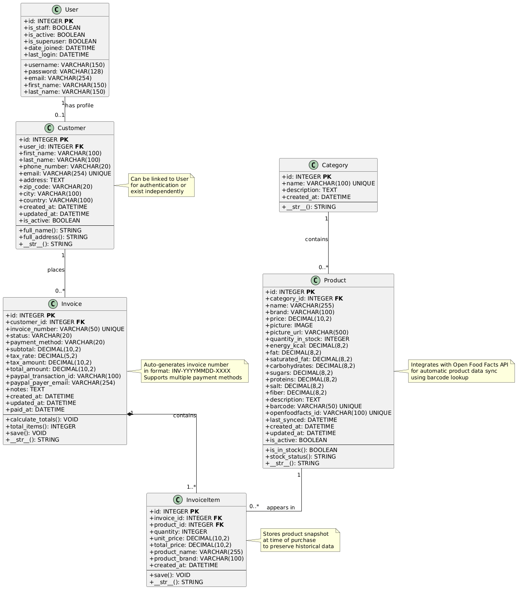
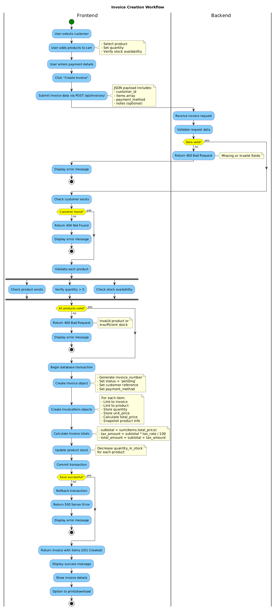
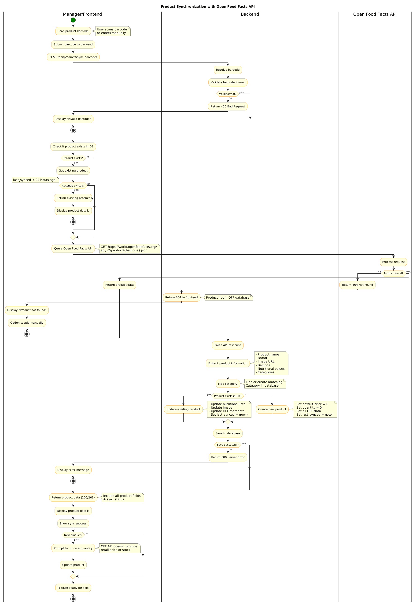
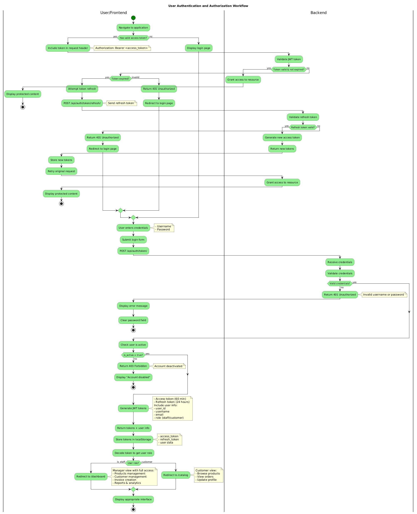
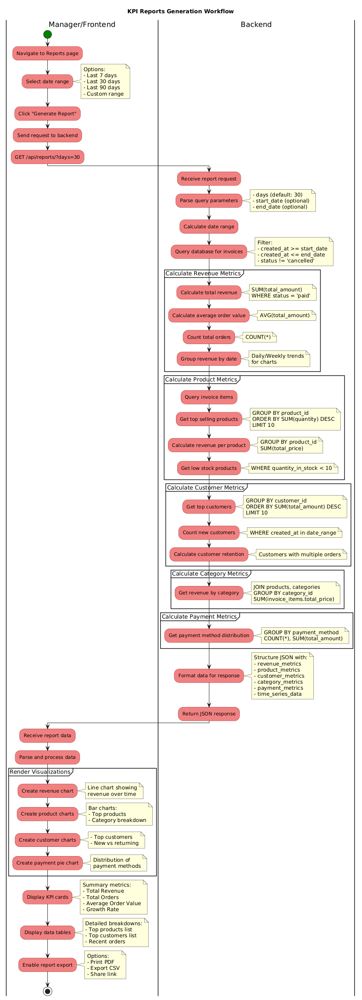

# UML Diagrams

This directory contains UML diagrams for the Trinity Development Web application in PNG format.

## Diagrams

### 1. Class Diagram
**File:** `class-diagram.png`

Shows the complete data model including:
- Django models (User, Customer, Category, Product, Invoice, InvoiceItem)
- Attributes and data types
- Relationships and cardinalities
- Key methods and properties



### 2. Activity Diagrams

#### Invoice Creation
**File:** `activity-invoice-creation.png`

Workflow for creating customer invoices:
- Product selection and validation
- Stock checking
- Invoice generation
- Payment processing
- Database transactions



#### Product Synchronization
**File:** `activity-product-sync.png`

Integration with Open Food Facts API:
- Barcode scanning
- API querying
- Data parsing and mapping
- Product creation/update
- Sync management



#### User Authentication
**File:** `activity-authentication.png`

Authentication and authorization flow:
- Login process
- JWT token generation
- Token refresh mechanism
- Role-based access control
- Session management



#### Report Generation
**File:** `activity-reports.png`

KPI and analytics workflow:
- Data aggregation
- Metric calculation
- Visualization preparation
- Export functionality



## Viewing the Diagrams

All diagrams are provided as **PNG image files** and can be viewed:

### Option 1: GitHub Web (Easiest)
Open any `.png` file in this folder - GitHub displays them automatically

### Option 2: Image Viewer
```bash
# macOS
open *.png

# Linux
xdg-open activity-authentication.png

# Windows
start class-diagram.png
```

### Option 3: VS Code
Simply double-click any `.png` file to view in VS Code's image viewer

### Option 4: Print/Embed
- Right-click and print directly
- Drag into presentations
- Attach to documents
